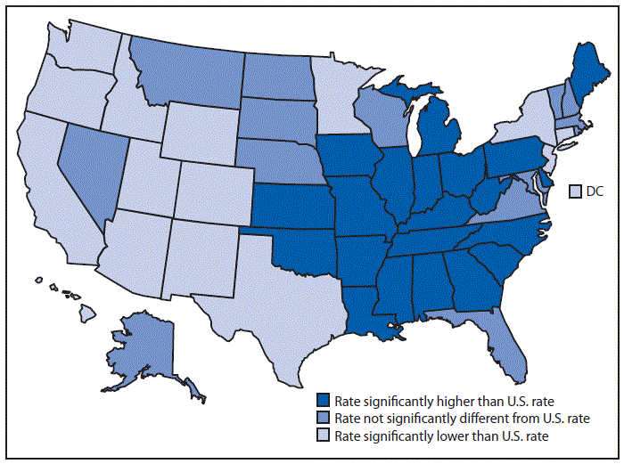
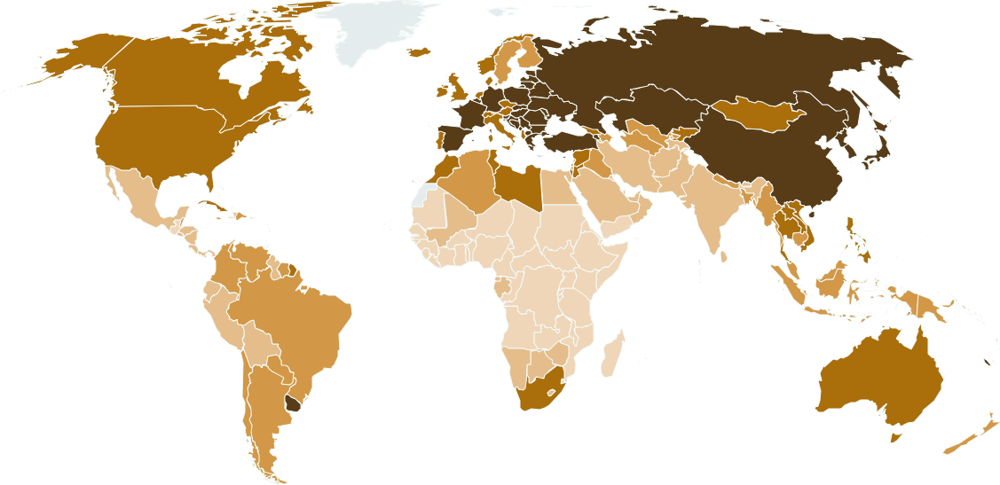

#  Lung Cancer by State 
Here is an interactive where you type in a state name and you get the number of lung cancer cases it has!

<!-- Title and introductory information about an interactive lung cancer data lookup by state -->

<head>
    <title>State Input</title>
</head>
<body>
    <h1>Enter a State Name</h1>
    <form id="stateForm">
        <input type="text" id="stateInput" placeholder="Enter a state name">
        <button type="submit">Submit</button>
    </form>

    

        <!-- The result from the backend will be displayed here -->
    

    
</body>

<!-- This section describes the interactive lung cancer data lookup by state, including the input form and JavaScript code for fetching data. -->

The distribution of lung cancer cases can be grouped by space. Some areas are more disproportionately affected by lung cancer cases than others. Some areas, especially low-income or areas next to factories, have a sharp increase in lung cancer cases.

<!-- Information about the distribution of lung cancer cases based on geographical factors -->

##  Distribution Maps 

<!-- Subsection title about distribution maps -->

##  San Diego County Lung Cancer Cases 
.jpeg>)

<!-- Information about lung cancer cases in San Diego County with an image -->

##  California Lung Cancer Cases 

<!-- Information about lung cancer cases in California with an image -->

##  United States Lung Cancer Cases 

<!-- Information about lung cancer cases in the United States with an image -->

##  World Lung Cancer Cases 

<!-- Information about global lung cancer cases with an image -->
