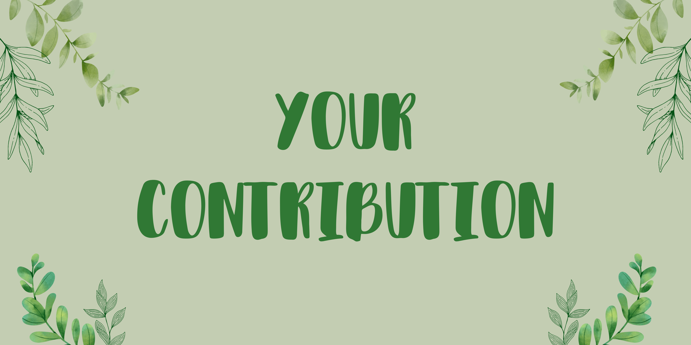

<!-- Introduction and title of the page -->
You can make a positive impact by supporting organizations working to address critical issues related to lung cancer and climate change. Your donations can help fund research, provide support to affected individuals, and drive initiatives to combat these challenges. Below, you'll find links to reputable organizations where you can make contributions:

<!-- Explanation of how readers can contribute to the causes of lung cancer and climate change -->

##  Lung Cancer 

<!-- Section title related to Lung Cancer -->

### [Lung Cancer Foundation of America](https://lcfamerica.org/donate/)
<!-- Organization 1: Lung Cancer Foundation of America -->
The Lung Cancer Foundation of America (LCFA) is dedicated to funding innovative and promising research in the fight against lung cancer. Your donations support groundbreaking advancements in prevention, early detection, treatment, and ultimately, finding a cure.

### [American Lung Association](https://www.lung.org/get-involved/ways-to-give)
<!-- Organization 2: American Lung Association -->
The American Lung Association works tirelessly to improve lung health and prevent lung disease through education, advocacy, and research. Your donations can contribute to their efforts in reducing the impact of lung cancer and respiratory conditions.

### [Cancer Research Institute](https://www.cancerresearch.org/join-the-cause/donate)
<!-- Organization 3: Cancer Research Institute -->
The Cancer Research Institute (CRI) funds cancer immunotherapy research, including research into lung cancer treatments. Your support helps advance innovative approaches to fighting cancer.

##  Climate Change 

<!-- Section title related to Climate Change -->

### [Environmental Defense Fund](https://www.edf.org/give)
<!-- Organization 4: Environmental Defense Fund -->
The Environmental Defense Fund (EDF) focuses on finding solutions to combat climate change and protect the environment. Your donations support their work in advocating for policies, clean energy solutions, and sustainable practices.

### [The Nature Conservancy](https://www.nature.org/en-us/what-we-do/our-insights/perspectives/support-our-mission/)
<!-- Organization 5: The Nature Conservancy -->
The Nature Conservancy is dedicated to conserving lands and waters while addressing climate change challenges. Your contributions help protect ecosystems and promote sustainable environmental practices.

### [350.org](https://350.org/donate/)
<!-- Organization 6: 350.org -->
350.org is a grassroots organization that mobilizes for climate action and divestment from fossil fuels. Your donations support their efforts in building a sustainable future.

##  Conclusion 

<!-- Conclusion section -->
Your contributions can make a real difference in the fight against lung cancer and climate change. These organizations are actively engaged in research, advocacy, and education, and your support can help drive positive change. Thank you for considering a donation to these important causes.

<!-- HTML code section begins -->

<html>
<head>
    <title>Indoor Air Quality</title>
    
</head>
<body>
    <h1>What is your indoor air quality score?</h1>
    <form id="quizForm">
        <!-- A quiz form for indoor air quality assessment -->
        <!-- Each question is presented as a set of radio buttons -->
    </form>
    
Your Score: 0

    <!-- A section to display the quiz score -->
</body>
</html>

<!-- HTML code section ends -->

Now compare your scores with your friends! Input your quiz score here and see how it compares with others. The higher the score the less you contribute to air pollution!!

<html>
<head>
    <title>Indoor Air Quality Scores</title>
    
</head>
<body>
    <h1>Indoor Air Quality Scores</h1>
    

        <label for "userName">Name:</label>
        <input type="text" id="userName">
        <label for "quizScore">Quiz Score:</label>
        <input type="number" id="quizScore" min="0">
        <button id="addData">Add Data</button>
    

    <canvas id="chart"></canvas>

<script>
        const userNames = [];
        const quizScores = [];
        const ctx = document.getElementById("chart").getContext("2d");
        let chart;

        document.getElementById("addData").addEventListener("click", () => {
            const userName = document.getElementById("userName").value;
            const quizScore = parseInt(document.getElementById("quizScore").value);
            userNames.push(userName);
            quizScores.push(quizScore);

            if (chart) {
                chart.destroy();
            }

            chart = new Chart(ctx, {
                type: "bar",
                data: {
                    labels: userNames,
                    datasets: [{
                        label: "Quiz Score",
                        data: quizScores,
                        backgroundColor: "rgba(75, 192, 192, 0.2)",
                        borderColor: "rgba(75, 192, 192, 1)",
                        borderWidth: 1
                    }]
                },
                options: {
                    scales: {
                        y: {
                            beginAtZero: true
                        }
                    }
               