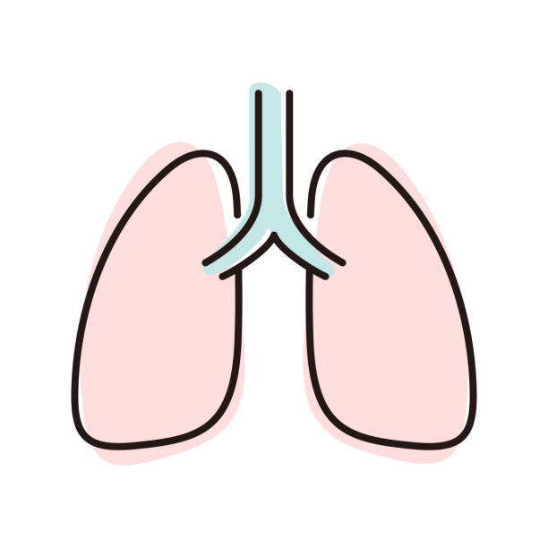

# Lung Cancer and Climate Change

Did you know that lung cancer is caused by climate change? On this website, we will tell you all about lung cancer and climate change and how they are linked to each other.

[**Lung Cancer**](lungs.md)

Climate change affects so many of us, and we want you to know the health impacts of this issue.

[**Climate Change**](/climate.md)

Lung Cancer is among the leading causes of death in people in the United States. We want to spread awareness about lung cancer as not many people know of this issue.

[**How can you help?**](/impact.md)

We will tell you ways YOU can help with this issue.

[**Our api**](/county.md)
This api will demonstrate how lung cancer affects states in the United States. Our Api can also give you aerosol data so you are able to check the days for which the air quality is good or bad in the year 2022. 

[**Lung Cancer Api**](/distribution.md)
This api will demonstrate the lung cancer cases per population in a state.  

