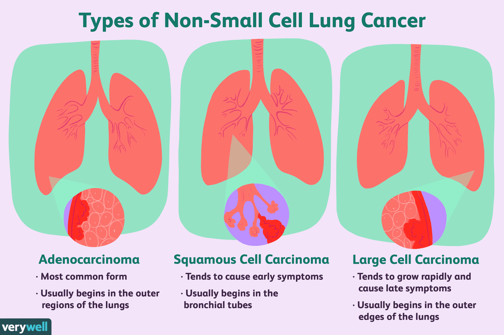
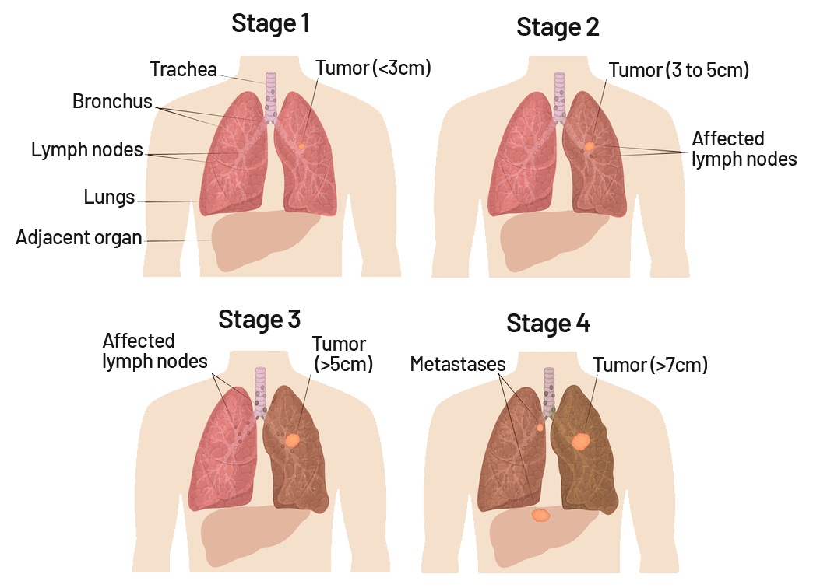

.png>)

<!-- Title and introductory image -->

Lung Cancer and Climate Change

<!-- Introduction to the page's purpose -->

Did you know that lung cancer is caused by climate change? On this website, we will tell you all about lung cancer and climate change and how they are linked to each other.

<!-- Table of Contents -->
<!-- Links to different sections within the document -->
## Table of Contents

<!-- Sections with links -->
- [What is Lung Cancer?](#what-is-lung-cancer)
- [Types of Lung Cancer](#types-of-lung-cancer)
- [Causes and Risk Factors](#causes-and-risk-factors)
- [Signs and Symptoms](#signs-and-symptoms)
- [Diagnosis and Staging](#diagnosis-and-staging)
- [Treatment Options](#treatment-options)
- [Living with Lung Cancer](#living-with-lung-cancer)
- [Prevention and Early Detection](#prevention-and-early-detection)
- [Support and Resources](#support-and-resources)
- [Conclusion](#conclusion)

<!-- Section: What is Lung Cancer? -->
##  What is Lung Cancer? 

<!-- Description of lung cancer -->
Lung cancer occurs when abnormal cells in the lung grow uncontrollably, forming a tumor. These tumors can interfere with lung function, making it difficult for the affected person to breathe. Lung cancer can be broadly categorized into two main types: non-small cell lung cancer (NSCLC) and small cell lung cancer (SCLC).

<!-- Section: Types of Lung Cancer -->
##  Types of Lung Cancer 

<!-- Descriptions of NSCLC and SCLC -->
- Non-Small Cell Lung Cancer (NSCLC): The most common type, accounting for around 85% of all lung cancer cases, with three subtypes.
- Small Cell Lung Cancer (SCLC): Less common but grows and spreads more quickly than NSCLC.

<!-- Image for Types of Lung Cancer -->

<!-- Section: Causes and Risk Factors -->
##  Causes and Risk Factors 

<!-- Factors contributing to lung cancer -->
The primary cause of lung cancer is exposure to carcinogens, with tobacco smoke being the leading risk factor. Other risk factors include secondhand smoke, exposure to radon gas, workplace exposures, and a family history of lung cancer.

<!-- Section: Signs and Symptoms -->
##  Signs and Symptoms 

<!-- Common symptoms of lung cancer -->
Common symptoms of lung cancer may include a persistent cough, chest pain, shortness of breath, unexplained weight loss, coughing up blood, and recurrent infections. Some cases may be asymptomatic in the early stages.

<!-- Section: Diagnosis and Staging -->
##  Diagnosis and Staging 

<!-- Overview of diagnosing lung cancer -->
Diagnosing lung cancer involves a combination of imaging tests, biopsies, and staging to determine the extent of the disease. Staging helps in planning appropriate treatment strategies.

<!-- Section: Treatment Options -->
##  Treatment Options 

<!-- Description of treatment options -->
Treatment options for lung cancer depend on the type, stage, and overall health of the patient. They may include surgery, radiation therapy, chemotherapy, targeted therapy, immunotherapy, and palliative care.

<!-- Image for Treatment Options -->

<!-- Section: Living with Lung Cancer -->
##  Living with Lung Cancer 

<!-- Coping with lung cancer -->
Living with lung cancer can be challenging, but it is possible to maintain a good quality of life with the right support.

<!-- Section: Prevention and Early Detection -->
##  Prevention and Early Detection 

<!-- Importance of prevention and early detection -->
Preventing lung cancer primarily involves avoiding exposure to carcinogens, particularly by quitting smoking and avoiding secondhand smoke. Early detection through regular screenings can improve treatment chances.

<!-- Section: Support and Resources -->
##  Support and Resources 

<!-- Available resources for lung cancer patients -->
Numerous organizations and support groups offer assistance to individuals and families affected by lung cancer. These resources provide information, emotional support, and guidance throughout the cancer journey.

<!-- Section: Conclusion -->
##  Conclusion 

<!-- Summary of lung cancer -->
Lung cancer is a serious and potentially life-threatening condition that requires prompt diagnosis and treatment. Understanding the risk factors, signs, and available treatment options can improve outcomes and the quality of life for those affected by this disease.

<!-- Image for Conclusion -->

<!-- Section: More information -->
##  More information 

<!-- Links to external sources for more information -->
- [CDC](https://www.cdc.gov/cancer/lung/basic_info/what-is-lung-cancer.htm)
- [Cancer Society](https://www.cancer.org/cancer/types/lung-cancer/about/what-is.html)
- [Mayo Clinic](https://www.mayoclinic.org/diseases-conditions/lung-cancer/symptoms-causes/syc-20374620)
- [Cleveland Clinic](https://my.clevelandclinic.org/health/diseases/4375-lung-cancer)

